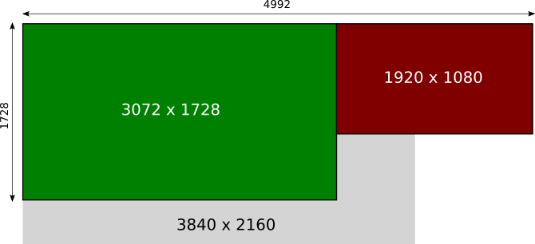

2023.07.24
---

> https://askubuntu.com/questions/1195244/difficulty-to-setup-two-monitors-with-different-resolution-and-scale

```bash
$ xrandr --output HDMI-1 --fb 4992x1728 --mode 3840x2160 --scale 0.8x0.8 --pos 0x0 --primary \
       --output HDMI-0 --mode 1920x1080 --scale 1x1 --pos 3072x0`
```

- the "screen" I refer to, a name used in xrandr manual, is a big desktop while monitors are viewports we configure around it.


- --scale XxY zooms or shrinks a desktop on a device. While this happens, the effective resolution changes as the visible part of the desktop are larger or smaller (see the picture); the important thing is that I had to work with this new dimension when defining other parameters, such as --fb XxY or --pos

- --fb XxY is to define the maximum dimension of a frame buffer. When calculating numbers for this parameter, all scales should be taken into account. After all, dimensions should add up to max X and Y. In my case, two adjacent monitors added up to 4992x1728.

- --pos XxY position monitors inside the frame buffer. A position of the primary monitor is 0x0, while a position of the secondary monitor is 3072, a dimension of the first monitor after scaling. If I used an original 3840, the pointer would disappear when moving between monitors because there would be a gap (see the lower screenshot). As a side note, in case of dimension 3840 is used, X at --fb XxY would need to be changed to 5760, as well.

