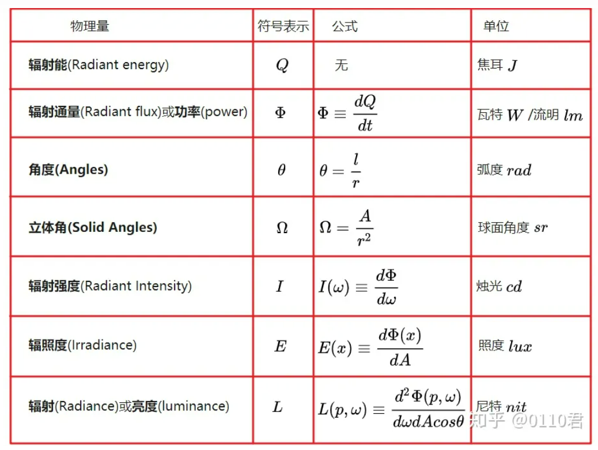
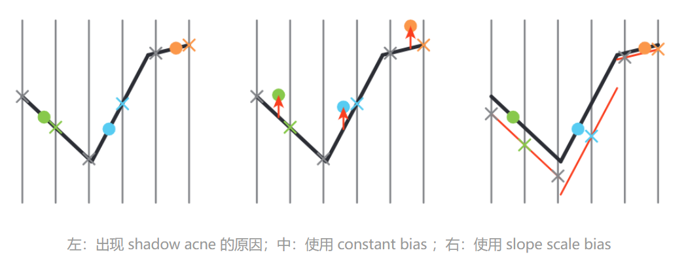
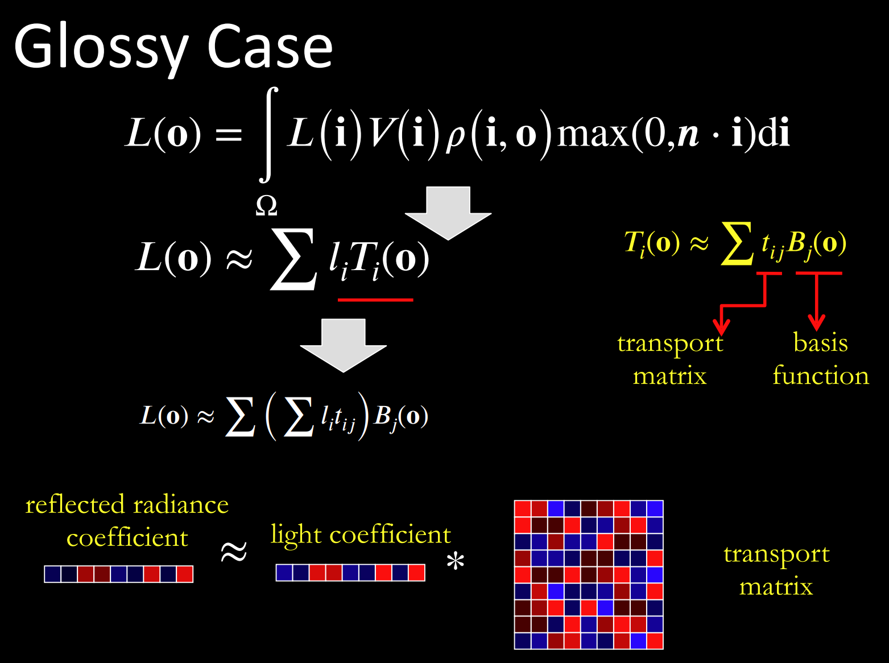
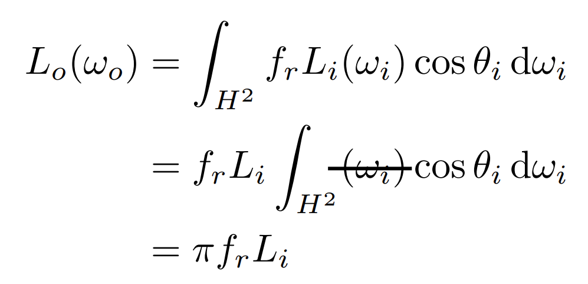
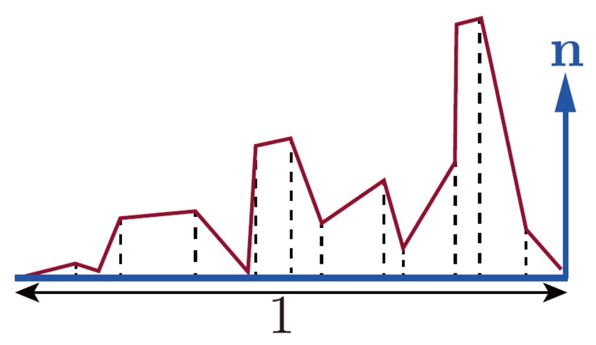

2023.04.04
---

## Rasterizer

- 流程

  应用阶段：

  几何阶段：顶点着色器，曲面细分着色器（对三角形面进行细分），几何着色器（增加或删除图元）

  光栅化：图元组装（裁剪，背面剔除），屏幕映射（透视除法，视口变换），三角形组装，三角形遍历，片元着色器

  测试混合：裁剪测试，alpha测试，模板测试，深度测试，alpha混合

- 光照模型
  - Lambert:

    环境光＋方向光

    Diffuse * Ambient + Diffuse * LightColor * dot(N, L)

  - Phong: 

    漫反射（考虑光从哪个角度过来所能打到的面积）＋环境光＋高光项（考虑反射向量与光线方向夹角）

    kd * (I / r^2) * max(0, dot(N, L)) + Ambient + ks * (I / r^2) * max(0, dot(L, R))

  - Blinn-Phone:

    将高光项进行更改，考虑半程向量与法线进行点乘

## AA

- SSAA

  超分辨率，对每一个pixel的多个sample都进行一次着色

- MSAA

  对同一个pixel产生的多个sample点只计算一次着色，共享当次着色结果

- TAA

  每帧采样时，将采样的点进行偏移，Halton采样序列，改写投影矩阵

  Motion Vector处理动，且clamp至合理范围内，如AABB包围盒内，$3\sigma$内

- FXAA(Fast Approximate Anti-aliasing)

  - 算法过程（quality）
  
    1. 计算对比度（周围5个点的亮度极差NEWS），对比度较小可以不进行抗锯齿

    2. 计算混合系数，用总共周围9个点进行计算

    3. 计算混合方向，分别计算水平方向与垂直方向的亮度变化，再计算是上下还是左右

    4. 按混合系数权重进行采样，也就是往变化方向大的方向偏移一点采样作为输出颜色

  - 考虑边界并不是水平或者垂直

    延边界两侧方向查询找到边界，再计算混合系数，混合系数取最大值

  - Console则
    
    - 以半像素采样斜对角线的点，然后计算边界法线方向

    - 往x和y方向分别偏移uv再平均

    - 斜向较好，水平不佳
    
      因此可以将切线的左右点往两边拉长，即变得更水平。但要注意如果拉长后的采样到了亮度变化较大的地方需要舍弃

  - Cons:

    光照高频(颜色变化很快)的地方会不稳定，移动时会有闪烁现象

## Ray tracing

- 辐射度量学

  

- 渲染方程

  Describes how much light is reflected into each outgoing direction

  

  

- 光线追踪模型

  - **Whitted-style**

    直接光照＋反射光照＋折射光照

  - **Path tracing**

  - Distributed ray tracing

  - Bidirectional path tracing(BDPT)
  
    顶光（没有直接光照）

  - Metropolis light transport(MLT)

    使用MCMC获得更多临近的sample满足可以从light到view，在光路复杂时很好

  - Photon mapping

  - Vertex Connection and Merging

  - Instant Radiosity

- 加速结构

  - 八叉树

  - KD树（每次划分一半，按xyz三个轴的顺序进行划分）

  - BSP树（多边形对齐bsp树）（Binary Space Partitioning）

  - BVH（Bounding Volume Hierarchies）

## Shadow

   拆分V项考虑阴影构成

  

  - PCF(Percentage Closer Filtering)

    - 为解决自阴影（以像素中心作为整个像素的深度导致精度不够）问题，可将场景深度增加一个偏移，但会导致接触处的阴影消失

      slope bias根据斜率决定bias大小

      

    - 可见处为1，因为V表示可见程度

      

  - PCSS(Percentage Closer Soft Shadow)

    1. Blocker search 

    2. Penumbra estimation(过滤大小估计)

    3. Percentage Closer Filter

  - VSSM(Variance Soft Shadow Mapping)

    - 第一步要获得当前区域中遮挡物深度均值

      考虑使用cdf进行估计，有切比雪夫不等式，则需要知道均值和方差
    
      Average and variance of Block distance(depth): 
      
      - MIPMAP(FAST, APPROXIMATE, SQUARE)

      - SAT
    
    - 第三步是当前区域中有多少像素深度比当前低，同样可以通过切比雪夫估计

    - Moment shadow mapping

      使用更精确的方式表示分布函数
  
  - DFSS(Distance Filed Soft Shadow)

    用于获得每次移动的距离，以及在该点的可视角度（用于估计V）

    

    k越大越硬

  - CSM(Cascaded shadow map)
    
    可提高shadow map精度，针对视锥体中不同位置使用不同光锥体进行渲染

    - 在渲染视角附近的物体时需要更高的shadow map精度

    - 指数分布的CSM或自指定

    - Stablize CSM: 视锥体发生变化，就会造成两帧直接的阴影位置不一样，抖动现象

      将相机的移动分成两个部分来处理，分别是相机的旋转和平移

      - 旋转：球形 Bounding volume 是不变的

      - 平移：偏移投影矩阵，从原点变换至shadow map坐标，进行对齐

## Physically Based Environment Lighting

- IBL(**Shading** from environment light)

  避免采样，解析解。没有阴影因为没有考虑V项

  

  For BRDF glossy(small support) or diffuse(smooth)

  1. Left: 对光源的平均即是对环境光贴图做模糊后直接取样

  2. Right: Precompute

    

    转化成关于$cos \theta$和roughness的函数，texture保存

- PRT(Shading and **Shadowing**)

  SH函数，可旋转

  - Diffuse

    

    
    
    Light transport 可以看作球谐函数基函数直接做光照

  - Glossy

    Light transport 作为一个与观察方向o相关的一个函数，即一个Matrix

    

  - Interreflections and Caustics

    都是需要预计算Light transport项

  - Wavelet transformation
    
    会保留高频信息

## GI

  one bounce indirect illumination

- RSM(Reflective Shadow Maps)

  考虑直接光源照到的地方成为第二光源进行补光

  要求反射源必须是diffuse，以获得均匀Li，(?使用深度直接作为距离)

  - Cons:

    并不是每一个pixel都可以为其它地方补光（V的问题），考虑采样

- LPV(Light Propagation Volumes)

  找第二光源 -> 划分小格记录 radiance(可使用SH函数记录) -> 演算 -> Render
 
  Radiance 在传输过程中不会衰减

  - Cons:

    小格划分问题，可能会出现light leaking

- VXGI(Voxel Global Illumination)

  基于体素，two pass

  - Pass1: 获取场景中的各项属性（简介光照和法线分布）

  - Pass2: 有类似的层级保存，根据cone的大小逐层获取信息。glossy的就发一个cone，diffuse的发多个。

- SSAO(Ambient Occlusion)

  假设来自各个方向的间接光是相同的，但考虑每一点的V是不同的，diffuse

  

  使用z-buffer直接计算ka项，sample然后比较

- HBAO

  需要法线信息，采样更自由，可以加权采样

- SSDO(Directional Occlusion)

  

  AO考虑被挡住了就没法被外部照到了，由远处给我打光

  DO考虑远处的点打不到我这点光，由近处的点给我打光，问题就是远处的光就照不到了

- SSR

  1. 在屏幕空间中找到对应的反射点

    - Hierarchy ray tracing

    - Min pooling

  2. shading

    反射物（次级光源）是 diffuse 的

    有反射点信息作为Li，只需要直接计算即可

## PBR

- BRDF

  - Diffuse

    - Lambert（传统型）
      
      Light is equally reflected in each output direction

      

    - 基于物理型

      
  
  - Specular(Microfacet Cook-Torrance BRDF)

    

    - F

      Reflectance depends on incident angle (and polarization of light)

      - Fresnel Equation

        

      - Schlick 

        

    - D

      给定以h为中心的无穷小立体角$\mathrm{d} \omega$和无穷小宏观平面$\mathrm{dA}$，$D(m)\mathrm{d}\omega\mathrm{dA}$是相应微表面部分总面积，即描述了有多面基会往该方向反射。

      - 在法线方向积分D即面积（微表面的总面积始终不小于宏观表面总面积）

      - 投影到宏观平面积分结果为1（若观察方向为法线方向，则其积分可以归一化。即v = n时）

        

      - 投影到垂直于观察方向的平面进行积分等于该宏观平面的大小（任何方向上微观表面投影面积始终与宏观表面投影面积相同）

        

      - 常用分布函数

        一般考虑半程向量与法线的夹角

        - Blinn-Phong分布

        - Beckmann分布(Cook-Torrance)

          

        - GGX（Trowbridge-Reitz）分布

          

        - Generalized-Trowbridge-Reitz（GTR）分布

      - 形状不变性（shape-invariant）是一个合格的法线分布函数需要具备的重要性质。具有形状不变性（shape-invariant）的法线分布函数，可以用于推导该函数的归一化的各向异性版本，并且可以很方便地推导出对应的遮蔽阴影项G。(Beckmann GGX)

    - G

      光有D不行，还需要知道可见法线的分布，因此需要G1。
      
      Shadow-mask，G2(微平面BRDF一般就是G2)还考虑光照的可见性。

      几何函数的解析形式的确认依赖于法线分布函数以及几何函数的模型（即微表面轮廓）。

      - 常用G函数

        - V腔遮蔽函数(Cook-Torrance)

        - Smith

          

          $\Lambda$表示微表面斜率上的积分，有形状不变性的D能推出解析式

      - 分离的遮蔽阴影函数

        考虑遮蔽（masking）和阴影（shadowing）独立的，将G项拆成两项相乘

      - 多重散射微平面BRDF

        模微平面模型时所做出的单散射假设，没有模拟微表面上的多次散射
      
        能量损失，需要把能量补回来

